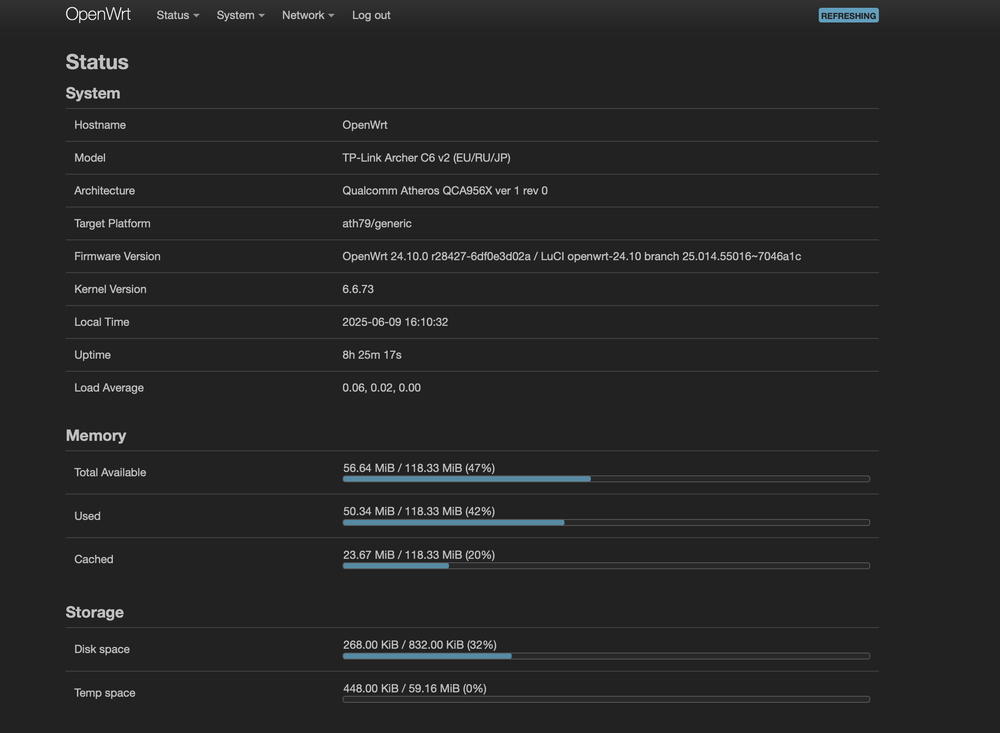

# Projects
Learn by doing the thing

# Homelab

This project isn't finished yet and I constantly make changes to it. Next goals are:

- Add switch
- VPN for remote connections
- Learn monitoring & logging (Prometheus + Grafana)
- Add new applications (Immich, Nextcloud, etc.)
- Add screenshots and photos
- Keep learning and have a fun... )

### Hardware:

- Laptop Lenovo ThinkPad T480 (Proxmox)
  - Processor: `Intel Core i7-8650U`
  - RAM: `16GB`
  - SSD: `256GB`
- Router TP-Link Archer C6 v2 (OpenWRT)
  - Ports: `4`
  - Speeds: `1000Mbps`

### Tech Stack:

- Proxmox
- OpenWRT
- Ubuntu Server
- Rocky Linux
- LXC Containers
- Docker
- Pi-Hole (DNS, Ad-blocker)
- Samba File Server
- Nginx
